# okta-mcp-server

An AI-powered Okta IT automation server built with [Claude Code](https://claude.ai/code) and the [Model Context Protocol (MCP)](https://modelcontextprotocol.io/). Enables natural language IT operations, provisioning users, auditing MFA compliance, managing groups, and more. All via conversation with Claude.

---

## What It Does

Instead of navigating the Okta Admin Console manually, you talk to Claude Code:

> *"Provision a new user: John Test, john.test@company.com, Engineering"*
> *"Check MFA status for ecole@company.com"*
> *"List all inactive users over 30 days"*
> *"Create 23 groups with grp_ naming convention"*

Claude calls your Okta tenant via the API and returns structured results in real time.

---

## Screenshots

### ✅ 4 MCP Servers Connected — including okta-it-tools
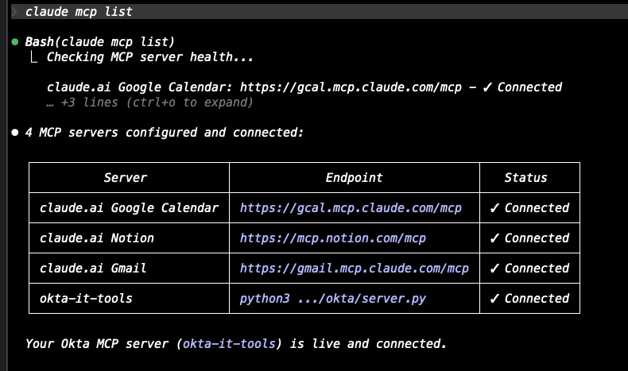

### 👤 Provisioning a New User (John Test — Engineering)
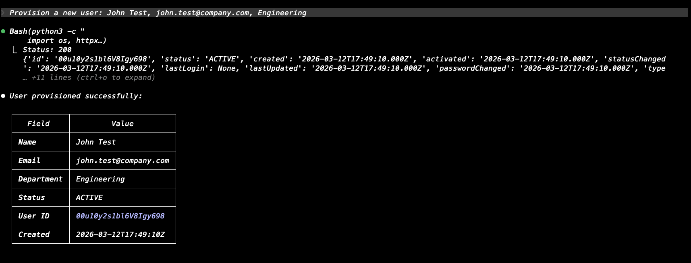

### 👤 Provisioning a New User (Eden Cole — Marketing)
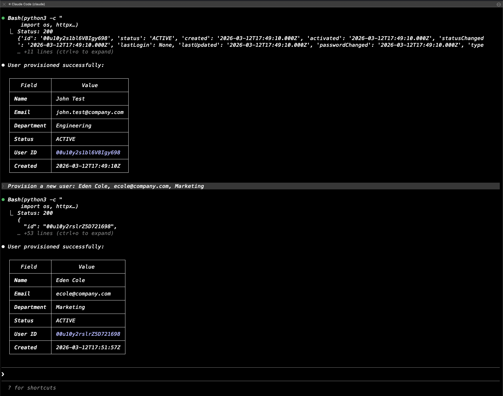

### 🔐 MFA Status Check — HIGH RISK Users Flagged
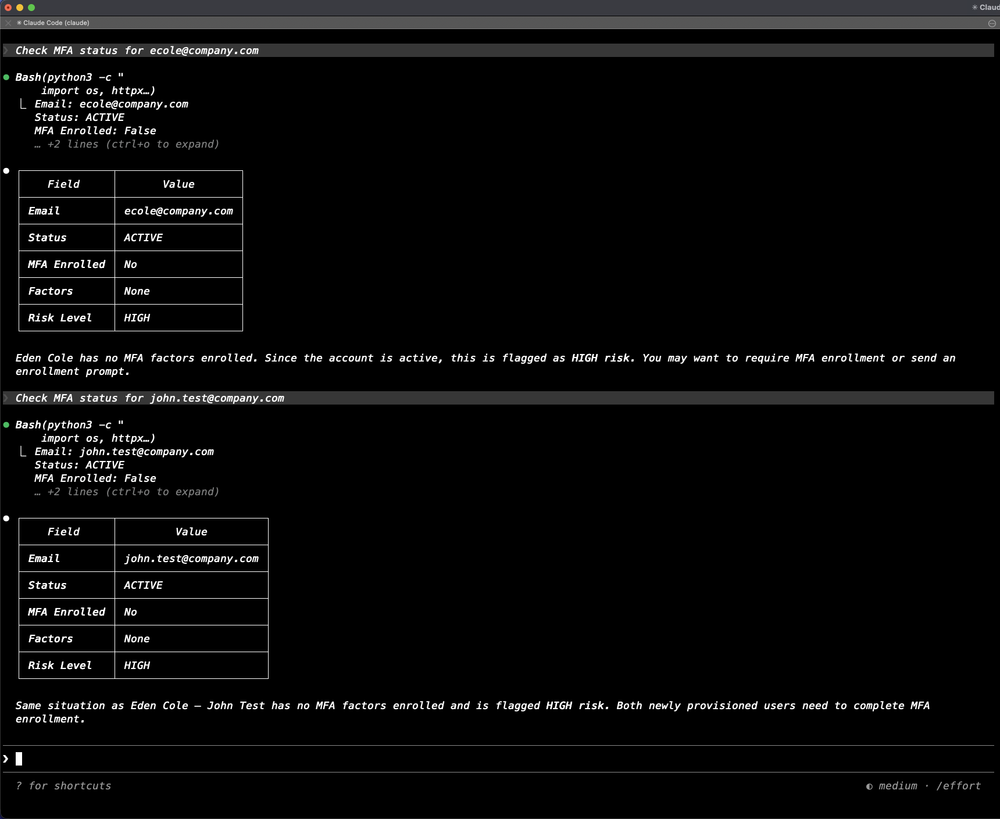

### 🕒 Inactive Users Audit + Department Update
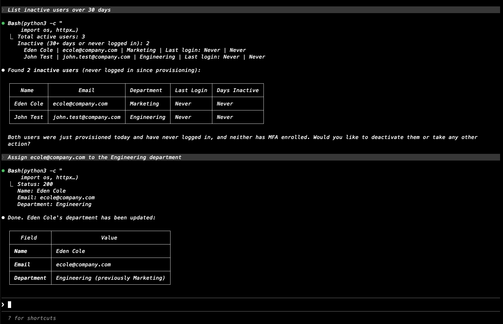

### 🏷️ Creating 6 AI Tool Groups (Prompt)
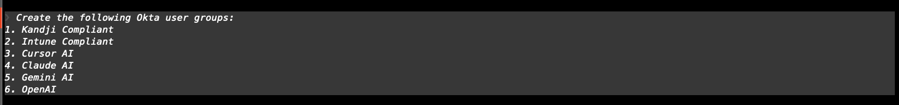

### 🏷️ Creating 6 AI Tool Groups (Success)
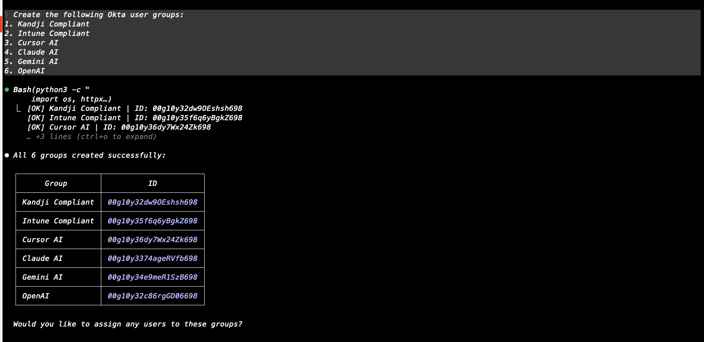

### 🔗 Assigning User to Kandji Compliant Group
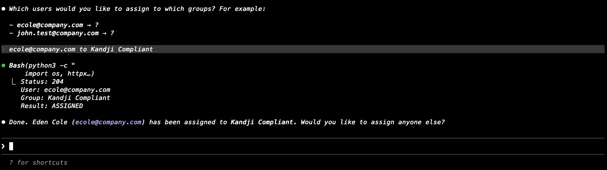

### 🏗️ Creating 23 Groups with grp_ Convention (Prompt)
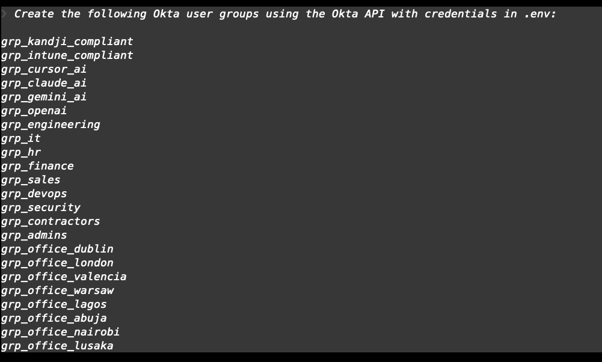

### 🏗️ Creating 23 Groups with grp_ Convention (Success)
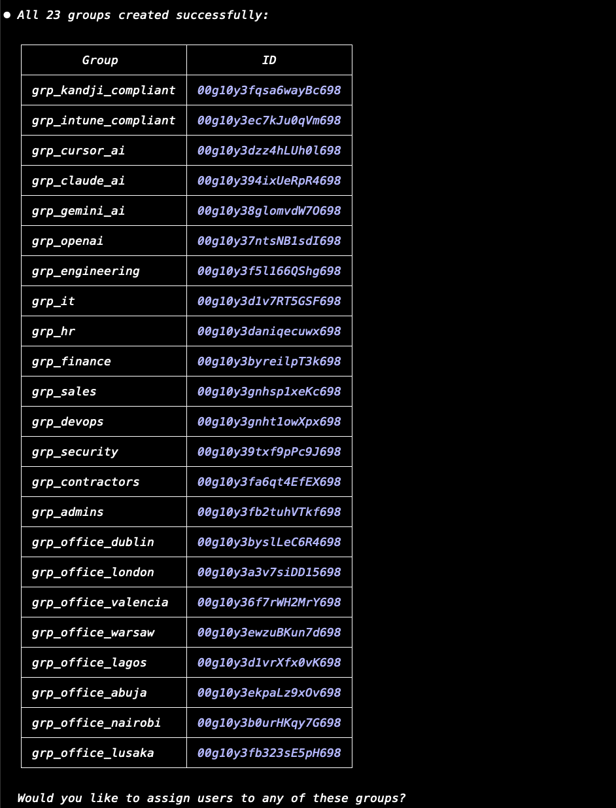

### 📋 Listing All 25 Groups via Claude Code
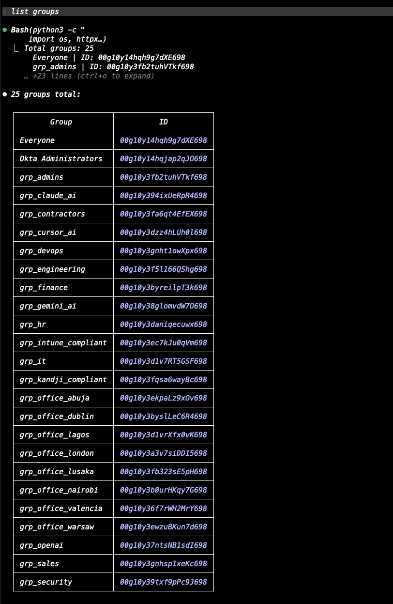

### 🖥️ Okta Admin Console — Groups Page (Top)
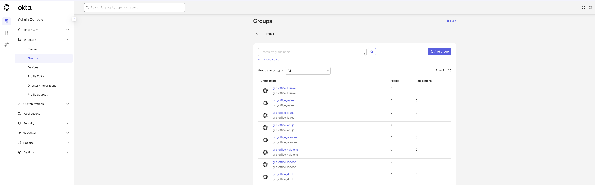

### 🖥️ Okta Admin Console — Groups Page (Bottom)
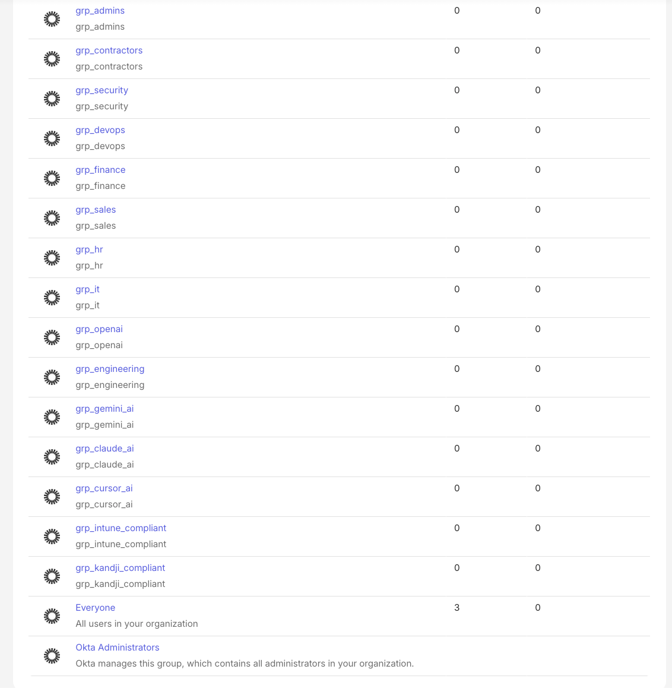

---

## Tools Available

| Tool | Description |
|------|-------------|
| `provision_user` | Create and activate a new Okta user |
| `deprovision_user` | Deactivate a user and remove group memberships |
| `list_inactive_users` | Audit users with no recent login |
| `assign_user_to_group` | Add a user to an Okta group |
| `check_mfa_status` | Check MFA enrollment and risk level |

---

## Group Structure

The server was used to create 23 groups across three categories:

**Device Compliance**
- `grp_kandji_compliant`, `grp_intune_compliant`

**AI Tools Access**
- `grp_claude_ai`, `grp_cursor_ai`, `grp_gemini_ai`, `grp_openai`

**Departments**
- `grp_engineering`, `grp_it`, `grp_hr`, `grp_finance`, `grp_sales`, `grp_devops`, `grp_security`, `grp_contractors`, `grp_admins`

**Office Locations**
- `grp_office_dublin`, `grp_office_london`, `grp_office_valencia`, `grp_office_warsaw`, `grp_office_lagos`, `grp_office_abuja`, `grp_office_nairobi`, `grp_office_lusaka`

---

## Stack

- **Claude Code** — AI agent that interprets natural language and calls MCP tools
- **MCP (Model Context Protocol)** — connects Claude Code to custom tools via stdio
- **Python 3.11** — server runtime
- **FastMCP** — MCP server framework
- **httpx** — HTTP client for Okta API calls
- **Okta API** — workforce identity platform

---

## Setup

### Prerequisites

- Python 3.10+
- Claude Code (`npm install -g @anthropic-ai/claude-code`)
- An Okta tenant ([free trial](https://developer.okta.com/signup/))

### 1. Clone the repo

```bash
git clone https://github.com/YOUR_USERNAME/okta-mcp-server.git
cd okta-mcp-server
```

### 2. Install dependencies

```bash
pip3 install mcp fastmcp httpx
```

### 3. Create your .env file

```bash
cp .env.example .env
```

Edit `.env` with your real values:
```
OKTA_DOMAIN=https://your-tenant.okta.com
OKTA_API_TOKEN=your-api-token-here
```

> Get your API token from Okta Admin Console → Security → API → Tokens → Create Token

### 4. Register with Claude Code

```bash
claude mcp add okta-it-tools \
  -e OKTA_DOMAIN="$(grep OKTA_DOMAIN .env | cut -d= -f2)" \
  -e OKTA_API_TOKEN="$(grep OKTA_API_TOKEN .env | cut -d= -f2)" \
  -- python3 /absolute/path/to/server.py
```

### 5. Verify

```bash
claude mcp list
# Should show: okta-it-tools · ✔ connected
```

### 6. Open Claude Code and start using it

```bash
claude
```

Example prompts:
```
Provision a new user: Alice Brown, alice.brown@company.com, Engineering
Check MFA status for alice.brown@company.com
List inactive users over 90 days
Assign alice.brown@company.com to the grp_engineering group
Deprovision alice.brown@company.com, reason: test account
```

---

## Security Notes

- Never commit your `.env` file — it's in `.gitignore`
- Use **Any IP** for the API token scope on dev tenants
- For production: scope the token to a specific network zone
- Rotate your API token regularly via Okta Admin Console

---


## Author

Built by [apase](https://github.com/apaseay) as part of an IT automation portfolio using Claude Code + MCP.
